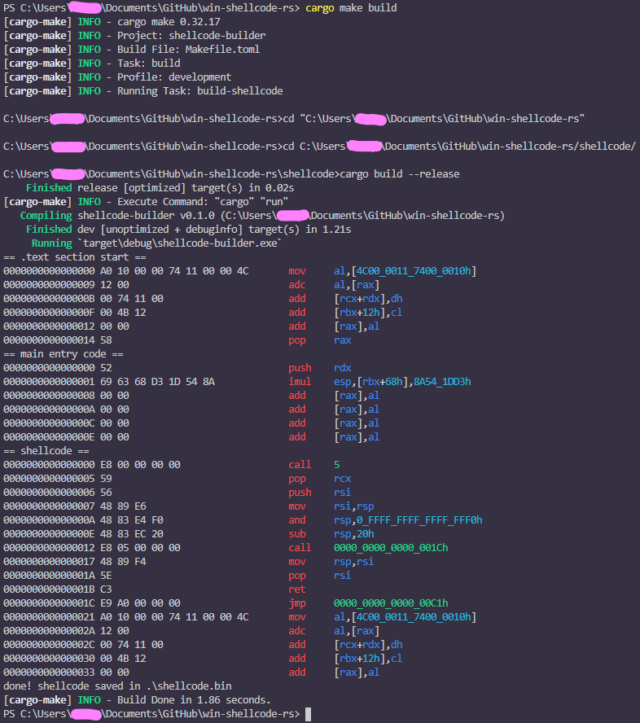
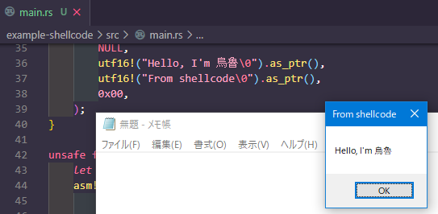

win-shellcode-rs
===

windows shellcode template that generates improved shellcode based on the project at [b1tg/rust-windows-shellcode](https://github.com/b1tg/rust-windows-shellcode).

## Overview

First of all, I am very grateful to [b1tg/rust-windows-shellcode](https://github.com/b1tg/rust-windows-shellcode).</br>
Because I couldn't find any other resources for doing windows shellcode in Rust.</br>
I like Rust, so I was very impressed to be able to do this.</br>
But, there is a problem with the [b1tg/rust-windows-shellcode](https://github.com/b1tg/rust-windows-shellcode) shellcode.</br>
For example, when execute shellcode as a thread of a any process, the thread does not terminate normally.</br>
Since the loop is called at the end of the main function, the shellcode goes into an infinite loop when it's done.</br>
I wanted the shellcode to terminate the thread normally when it was done, so I decided to fork it and make an improved shellcode.</br>
Specifically, before patching the jmp code, i added another shellcode.</br>
This shellcode is called bootstrap code and can call a specific function correctly according to the [Windows calling convention](https://docs.microsoft.com/ja-jp/cpp/build/x64-calling-convention?view=msvc-160)(but this is for x64),</br>
so the thread can be terminated normally when it returns.</br>
And Since we are assuming only 64-bit and not a 32-bit environment here, another modification is required if want to run on 32-bit.</br>
Also, the main function can have arguments, but bootstrap code needs to be modified.</br>
Find out more about Windows ABIs.</br>

## Requirements
- x64 Windows(tested Windows 10 x64), because my bootstrap shellcode assumes x64 only
- as Option, `cargo-make`(if have, its easier to build than manually typing the command)

## Usage
Feel free to edit `shellcode/main.rs` and look at the Build section.

## Build
`shellcode/main.rs` is almost empty. You need to edit it.</br>
Or, `example-shellcode` has sample code that calls `MessageBoxW`.</br>
So, write your own code, or rename `example-shellcode` to `shellcode`, or edit `win-shellcode-rs/main.rs` like a this:</br>

```rust
// let src_path = "shellcode\\target\\x86_64-pc-windows-msvc\\release\\shellcode.exe";
let src_path = "example-shellcode\\target\\x86_64-pc-windows-msvc\\release\\shellcode.exe";
```

then,

if have `cargo-make`, just type `cargo make build`

if not have,

```shell
cd shellcode
cargo build --release
cd ../
cargo run
```

Done. will generate shellcode.bin to current place.(`win-shelcode-rs\`)

Try using the shellcode runner and debugger to make sure that the original process is not affected after the shellcode is finished.

and, The console should show a nice result of disassemble :3

result of building `example-shellcode`:



result of executing `example-shellcode` shellcode on notepad:



## Reference
- [b1tg/rust-windows-shellcode](https://github.com/b1tg/rust-windows-shellcode)
- [x64-calling-convention](https://docs.microsoft.com/ja-jp/cpp/build/x64-calling-convention)
- [mattifestation/PIC_Bindshell](https://github.com/mattifestation/PIC_Bindshell)
- [monoxgas/sRDI](https://github.com/monoxgas/sRDI)
